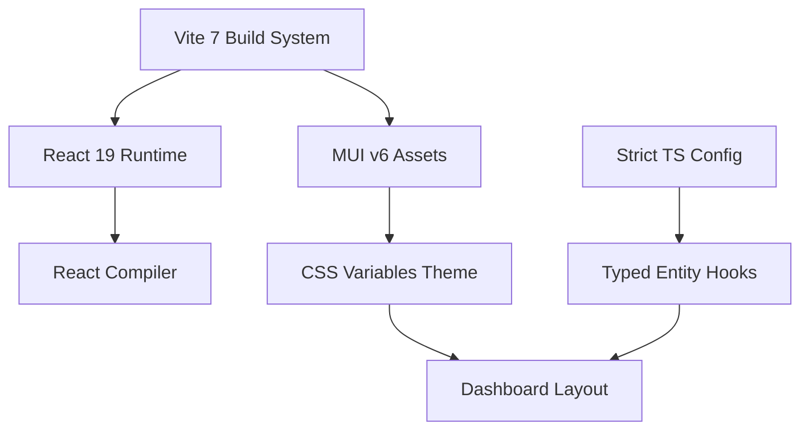

# Feature Landscape

**Domain:** Home Assistant Dashboard Modernization
**Researched:** Jan 2026
**Focus:** Foundation (Vite 7, React 19, Strict TS, MUI v6)

## Table Stakes

These are the baseline expectations for a modern React application in 2026. Failure to implement these results in technical debt immediately upon delivery.

| Feature                  | Why Expected                                                                                                      | Complexity           | Notes                                                                                     |
| ------------------------ | ----------------------------------------------------------------------------------------------------------------- | -------------------- | ----------------------------------------------------------------------------------------- |
| **Strict Type Safety**   | Prevents "undefined is not an object" errors common in dynamic HA entities.                                       | High (initial setup) | Requires `strict: true`, `noUncheckedIndexedAccess`. All HA entities must be typed.       |
| **Instant HMR**          | Developers expect <100ms updates. Vite 7 delivers this via Rolldown/Rust tooling.                                 | Low (native to Vite) | Critical for tweaking dashboard layouts efficiently.                                      |
| **CSS Variable Theming** | MUI v6 moves to CSS vars for theming. Enables instant light/dark mode switching without React context re-renders. | Medium               | Replaces legacy JS-based theme providers.                                                 |
| **Responsive Grid v2**   | MUI v6 standardizes Grid v2. Essential for dashboard cards that resize on mobile/tablet.                          | Low                  | Must use `Grid2` component, not legacy `Grid`.                                            |
| **React Actions**        | React 19 standard for handling form/interaction state (`useActionState`).                                         | Medium               | Replaces manual `useState` for loading/error states in mutations (e.g., toggling lights). |

## Differentiators

Features that leverage the new stack to provide superior Developer Experience (DX) or User Experience (UX) compared to legacy dashboards.

| Feature                  | Value Proposition                                                                                                               | Complexity         | Notes                                                       |
| ------------------------ | ------------------------------------------------------------------------------------------------------------------------------- | ------------------ | ----------------------------------------------------------- |
| **React Compiler**       | **Performance by default.** Automatically memoizes components and values. Eliminates manual `useMemo`/`useCallback`.            | Low (build config) | React 19 feature. Removes performance footguns.             |
| **Zero-Runtime Styles**  | **Faster TTI.** MUI v6 (via Pigment CSS) extracts styles at build time. No style injection lag on low-end tablets.              | High (migration)   | Requires avoiding dynamic JS interpolation in styles.       |
| **Typed Entity Hooks**   | **Dev Speed.** `useEntity('light.living_room')` auto-completes available entities and return types.                             | High (setup)       | Leverages Strict TS to validate entity IDs at compile time. |
| **Concurrent Rendering** | **Smoothness.** React 19 keeps the UI responsive (typing, scrolling) while heavy data updates (HA state) process in background. | Medium             | Native to React 19 but requires avoiding blocking effects.  |
| **Container Queries**    | **Responsive Components.** Styles based on component size, not viewport. Perfect for dashboard cards.                           | Medium             | Supported in MUI v6 theme.                                  |

## Anti-Features

Practices to explicitly avoid during the modernization process. These are "modern legacy" patterns that the new stack aims to eliminate.

| Anti-Feature                  | Why Avoid                                                                           | What to Do Instead                                                   |
| ----------------------------- | ----------------------------------------------------------------------------------- | -------------------------------------------------------------------- |
| **Manual Memoization**        | React 19 Compiler handles this. `useMemo` clutters code and is often wrong.         | Trust the Compiler. Only optimize when profiled.                     |
| **`makeStyles` / `styled`**   | Legacy runtime CSS-in-JS (Emotion/JSS) is slow and blocks the main thread.          | Use MUI `sx` prop (compiler-optimized) or CSS Modules / Pigment CSS. |
| **`any` for Entities**        | Defeats the purpose of migration. Causes runtime crashes when entities are missing. | Use `HassEntity` generics or unknown with guards.                    |
| **Default Exports**           | Makes refactoring and tree-shaking harder.                                          | Use Named Exports for all components.                                |
| **Barrel Files (`index.ts`)** | Slows down Vite HMR and tests by importing unused modules.                          | Import directly or keep barrels minimal/types-only.                  |
| **`ListItem` Props**          | `button`, `autoFocus`, `disabled` removed in MUI v6.                                | Use `ListItemButton` component.                                      |

## Feature Dependencies

## Modernization Behavior Expectations

### How Strict TS Works Here

- **Behavior:** The compiler will yell at you if you try to access `state.attributes.brightness` without checking if `brightness` exists or if `state` is defined.
- **Benefit:** Catches "light is off (null brightness)" bugs at compile time, preventing runtime White Screens of Death.

### How MUI v6 Works Here

- **Behavior:** Theming is done via `var(--mui-palette-primary-main)`. Changing a theme is just updating a CSS class on `<body>` or root, not a React tree re-render.
- **Benefit:** No "white flash" when switching themes; instant performance on cheap wall-mounted tablets.

### How Vite 7 Works Here

- **Behavior:** Cold start is near-instant. Dependencies are pre-bundled with esbuild/Rolldown.
- **Benefit:** Devs don't wait 30s for the dashboard to start.

## Sources

- [Vite 7 Roadmap/Features](https://github.com/vitejs/vite) (High Confidence)
- [React 19 Actions & Compiler Docs](https://react.dev/blog/2024/02/15/react-labs-what-we-have-been-working-on-february-2024) (High Confidence)
- [MUI v6 / Pigment CSS Introduction](https://mui.com/blog/material-ui-v6-is-out/) (Medium Confidence)
