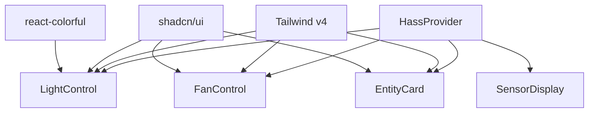

# Feature Landscape: v2.0 Shadcn Migration (Features Dimension)

**Domain:** Home Assistant Dashboard
**Researched:** 2026-01-28
**Focus:** Feature parity and migration from MUI to shadcn/ui

## Home Assistant Feature Mapping

Mapping existing MUI-based features to shadcn/ui equivalents.

| MUI Feature        | shadcn/ui Replacement | Complexity | Notes                                                                                                  |
| ------------------ | --------------------- | ---------- | ------------------------------------------------------------------------------------------------------ |
| **Entity Card**    | `Card` component      | Medium     | Requires recreation of MUI's elevation, ripple effects, and state-based styling.                       |
| **Power Switch**   | `Switch` + `Card`     | Low        | Radix-based switch for reliable touch interaction.                                                     |
| **Light Control**  | `Slider` + `Popover`  | High       | Brightness via Slider. Color via custom Popover + `react-colorful`. Requires debouncing service calls. |
| **Fan Control**    | `Slider` + `Select`   | Medium     | Speed via Slider (percentage) or Select (preset modes). Requires mapping modes.                        |
| **Sensor Display** | `Card` + `Badge`      | Low        | Use Badges for state/unit display.                                                                     |
| **Grid Layout**    | Tailwind Grid (v4)    | Medium     | Replaces `MuiGrid`. Requires mapping breakpoints (sm/md/lg) and column counts.                         |
| **Quick Actions**  | `Button` (variants)   | Low        | Standardized Button variants (ghost, outline, primary).                                                |

## Table Stakes

Baseline expectations for the v2.0 dashboard. Missing these will result in a regression from v1.0.

| Feature                | Why Expected                                 | Complexity | Notes                                           |
| ---------------------- | -------------------------------------------- | ---------- | ----------------------------------------------- |
| **State Sync**         | Components must reflect real-time HA state.  | Low        | Already handled by `HassProvider`.              |
| **Unified Dark Mode**  | Consistent dark theme across all components. | Low        | Using CSS variables and `next-themes`.          |
| **Touch Optimization** | Large tap targets for wall-mounted tablets.  | Medium     | Adjusting Shadcn defaults for larger hit areas. |
| **Unit Persistence**   | Sensors must display units (%, °C, LUX).     | Low        | Simple string interpolation from HA state.      |

## Differentiators

Features that leverage the shadcn/ui ecosystem for superior UX/DX compared to MUI.

| Feature                  | Value Proposition                                     | Complexity | Notes                                                   |
| ------------------------ | ----------------------------------------------------- | ---------- | ------------------------------------------------------- |
| **Tailwind 4 Native**    | Blazing fast styling, no runtime CSS-in-JS overhead.  | Medium     | Significant performance gain on low-power tablets.      |
| **Direct Customization** | Components in `src/components/ui/` are easily edited. | Low        | No more fighting with `sx` or `styled()`.               |
| **Micro-interactions**   | Framer Motion integration for state changes.          | Low        | Smooth transitions when lights toggle or values update. |
| **Smaller Bundle**       | Significant reduction in JS sent to the client.       | Medium     | Faster initial load and better memory usage.            |

## Anti-Features

Features/Patterns to explicitly avoid during the v2.0 migration.

| Anti-Feature             | Why Avoid                                     | What to Do Instead                                         |
| ------------------------ | --------------------------------------------- | ---------------------------------------------------------- |
| **Universal Card**       | Creating one "God Card" for all entity types. | Domain-specific cards (LightCard, FanCard, SensorCard).    |
| **Deep SX Prop**         | Using `sx` for layout or complex styling.     | Use Tailwind utility classes directly.                     |
| **Manual DOM Refs**      | Accessing HA state via global window or DOM.  | Always consume through `useHass` hook from `HassProvider`. |
| **Inline Magic Numbers** | Hardcoding colors or spacing in components.   | Use CSS variables defined in `@layer base`.                |

## Feature Dependencies

## MVP Recommendation

For the v2.0 migration, prioritize:

1. **Basic Toggle Card:** Switch + Card + Lucide Icon (PowerSwitch).
2. **Sensor Display:** Card + Badge (SensorDisplay).
3. **Brightness Control:** Simple Slider integration.
4. **Grid Migration:** Replacing MUI Grid with Tailwind `grid-cols`.

Defer to post-v2.0:

- **RGB Color Picker:** Use a placeholder or simple Select until `react-colorful` integration is polished.
- **Complex Charts:** Keep existing MUI/Recharts for history graphs until a Shadcn/Chart alternative is selected.

## Sources

- [shadcn/ui Components](https://ui.shadcn.com/docs/components/)
- [Radix UI Primitives](https://www.radix-ui.com/primitives)
- [Home Assistant Frontend API](https://developers.home-assistant.io/docs/frontend/)
- [Tailwind CSS v4 Documentation](https://tailwindcss.com/docs/v4-beta)
